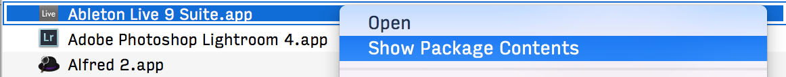

Ableton Live scene launcher app for iOS, written in Swift as a learning project.

The iOS app and Ableton Live communicate using the OSC protocol.

### Ableton Live setup on OS X

As Live doesn't have OSC support out of the box, you have to install LiveOSC first.

- Download and install Ableton Live 9: https://www.ableton.com/en/live/new-in-9/
- Download LiveOSC: https://github.com/hanshuebner/LiveOSC/archive/master.zip
- Install LiveOSC:
-- Open Finder and go to /Applications
-- Right-Click on Ableton Live and select _Show Package Contents_ 

-- Navigate to `Contents/App-Resources/MIDI Remote Scripts`
-- Drag the `LiveOSC` folder under `MIDI Remote Scripts`
- Restart Ableton Live
- In Ableton, go to Preferences -> MIDI Sync

### Copyright

Jari Aarniala, 2015.

License TODO
