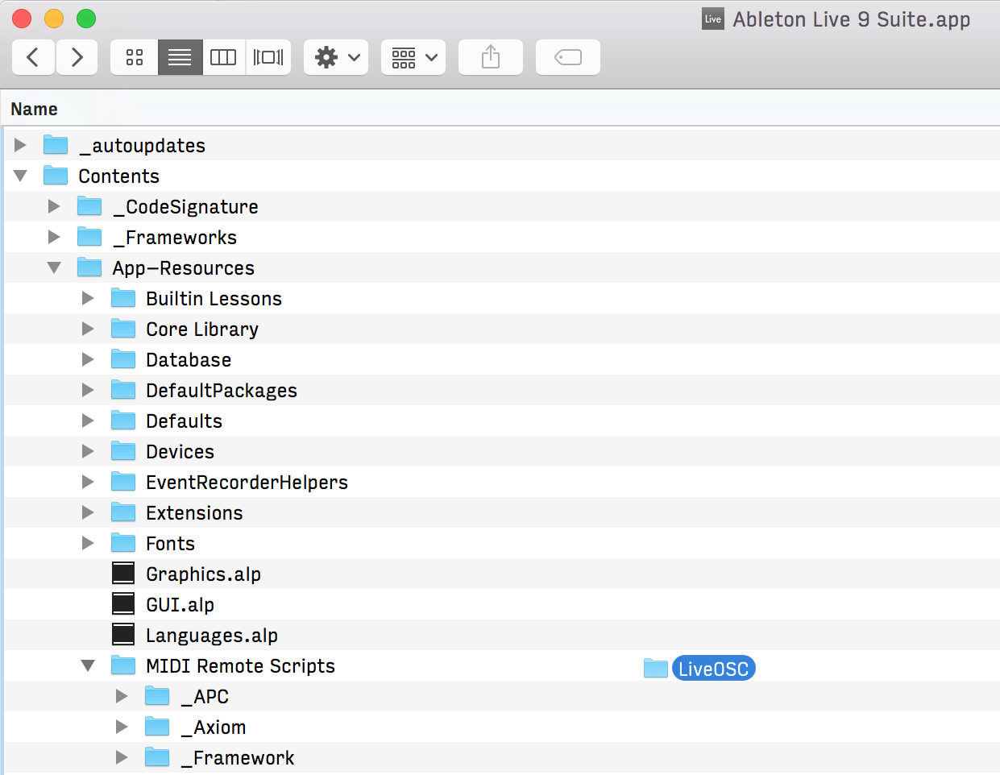
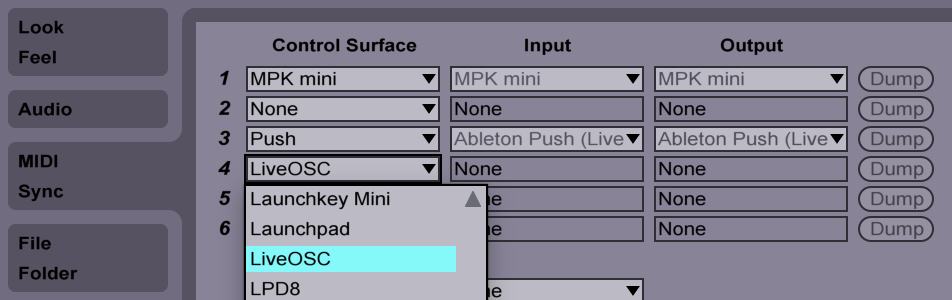

Ableton Live scene launcher app for iOS, written in Swift as a learning project.

### Setting up Ableton Live on OS X

The iOS app and Ableton Live communicate using the OSC protocol. 

However, Live doesn't have OSC support out of the box, and we have to install LiveOSC first.

- Download and install Ableton Live 9: https://www.ableton.com/en/live/new-in-9/
- Download LiveOSC and unzip the archive somewhere: http://livecontrol.q3f.org/ableton-liveapi/liveosc/
- Open Finder and go to /Applications
- Right-Click on Ableton Live and select _Show Package Contents_ 
    
- Navigate to `Contents/App-Resources/MIDI Remote Scripts`
- Drag the `LiveOSC` folder under `MIDI Remote Scripts`
   
- Quit Ableton Live if it is running
- Open Ableton Live and go to `Preferences` -> `MIDI Sync`
- Select `LiveOSC` from the control surface list

- You're all set!

### Copyright

Jari Aarniala, 2015.

License TODO
